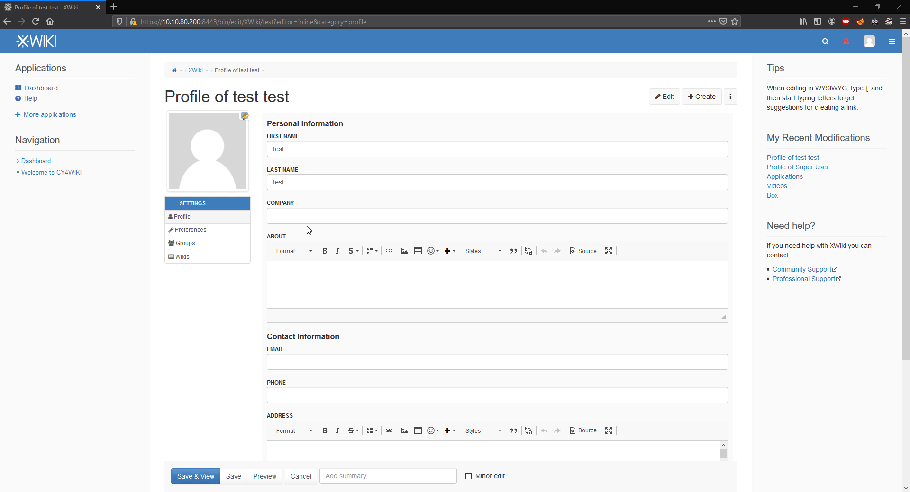

# CVE-2020-13654

## <mark style="color:yellow;">CVE Detail</mark>

In XWiki Platform before 12.8, some fileds like "Company" in the user profile editing section are vulnerables to Stored Cross Site Scripting (XSS).

<table><thead><tr><th width="111">Product</th><th width="175">CVE</th><th width="163">Owner</th><th width="175">CVSSv3 Score</th><th>CWE</th></tr></thead><tbody><tr><td><a href="https://github.com/xwiki/xwiki-platform">XWiki</a></td><td><a href="https://nvd.nist.gov/vuln/detail/CVE-2020-13654">CVE-2020-13654</a></td><td><a href="https://nstsec.com">Lorenzo Anastasi</a></td><td> <mark style="background-color:red;"><strong>7.5 High</strong></mark> </td><td><a href="https://cwe.mitre.org/data/definitions/116.html">CWE-116</a></td></tr></tbody></table>

## <mark style="color:yellow;">Exploitation Steps</mark>

As I first reported at [https://jira.xwiki.org/browse/XWIKI-17374](https://jira.xwiki.org/browse/XWIKI-17374), I report below the steps describing the identified vulnerability.

Some fileds like "Company" in the user profile editing section, are vulnerables to Cross Site Scripting XSS.

So, inserting for example "\" in the Company field someone has access to this page can inject malicious code.

An attacker can use XSS to send a malicious script to an unsuspecting user. The end user’s browser has no way to know that the script should not be trusted, and will execute the script. Because it thinks the script came from a trusted source, the malicious script can access any cookies, session tokens, or other sensitive information retained by the browser and used with that site.

Following are the steps to reproduce the vulnerability:

1. Login as admin
2. Create a test user
3. Open the user profile page ([https://localhost/bin/view/XWiki/](https://localhost/bin/view/XWiki/)\<user>)
4. Click edit button near Personal Information
5. Edit Company field and insert for example \
6. Save & View and see the XSS in action

<figure><figcaption></figcaption></figure>
